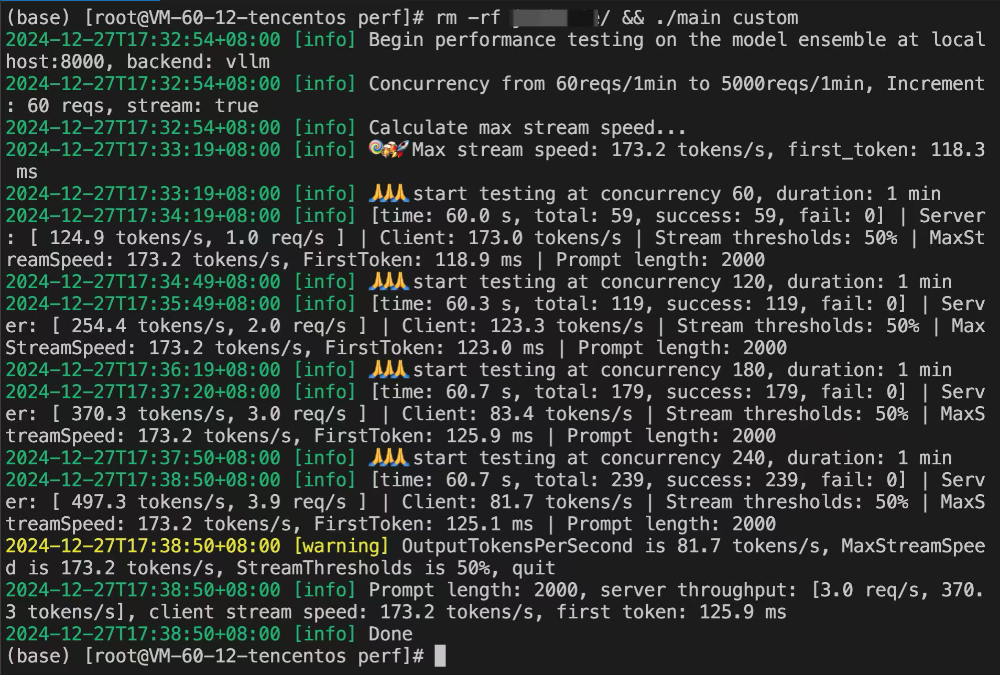

## LLM-Profiler
LLM-Profiler 是一个测试 llm 性能（速度和吞吐量）的工具，适配了 [TensorRT-LLM](https://github.com/NVIDIA/TensorRT-LLM)、[vLLM](https://github.com/vllm-project/vllm/)、[TGI](https://github.com/huggingface/text-generation-inference) 等常见的 LLM 推理框架。
与 [vLLM](https://github.com/vllm-project/vllm/tree/main/benchmarks) 等推理框架的性能测试不同，这些推理框架在测试性能的时候，主要测试的是离线场景下系统的极限吞吐量，比较适合跑 benchmark 显示自己的性能极限，但是这些框架的测试方法并不适合实际在线场景下的性能测试。

本工具注重实际在线推理场景下，考虑业务延迟要求、符合线上实际请求分布下的系统吞吐量。 所以并不会像这些推理框架的测试方法一样预先准备特定 batch 大小的数据。测试数据长度的分布也具有一定的离散性，符合在线推理数据分布特点。 同时，工具统计的一些[指标](internal/perf/throughput/statistics.go)也比较符合业务实际的需求。

## 使用说明
### 数据集
由于测试[数据集](data)比较大，需要使用 git lfs 下载
- ```brew install git-lfs```
- ```git lfs install```

### 运行方式

1. **单条速度**测试 (不关注并发)
   - ```go run main.go speed -b vllm -i 127.0.0.1 -p 8100 -m llama-70b -u nullxjx -l 1000``` 
   - -l 参数用于指定输入prompt长度（token数量），不指定的话使用默认很短的prompt
2. **吞吐量** 自定义测试
   - 修改 [config_local.yml](./config/config_template.yml)文件
   - ```go run main.go custom -c config/config_local.yml```

### 修改日志级别
可以通过环境变量修改日志级别，默认是 Info 级别
- 2，表示 Error 级别
- 3，表示 Warn 级别
- 4，表示 Info 级别
- 5，表示 Debug 级别

```bash
Log=5 go run main.go custom
```

### 运行截图
