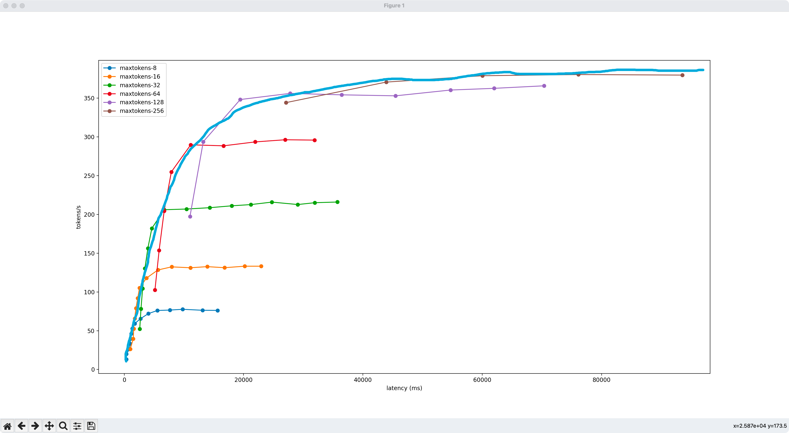
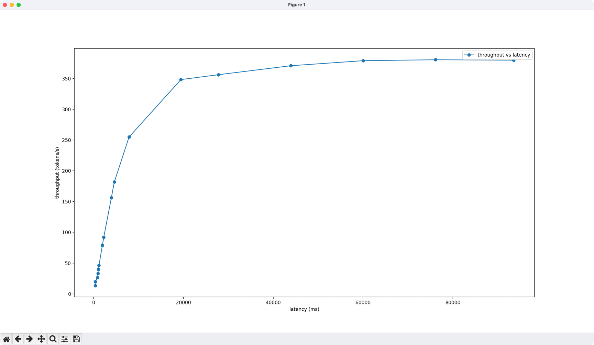

这里存放对性能测试结果进行可视化的脚本

使用方法：
1. 把🚀性能测试小群里的cos路径贴在[input.json](./input.json)文件中，每个路径的数据取个不一样的label
2. 运行 ```python perf_visualizer.py```，可以得到若干指标随着并发量变化情况

说明：
[perf_visualizer.py](./perf_visualizer.py) 中的 visualize_throughput_vs_latency_multi_merge 函数，是为了融合设置多个max_tokens参数得到的多组数据到一条曲线中。

简单来说，就是把下面这张图中的多条曲线


拟合成下面手绘的蓝色曲线


具体效果如下：


运行完脚本之后，会把可视化图片保存在tmp目录下